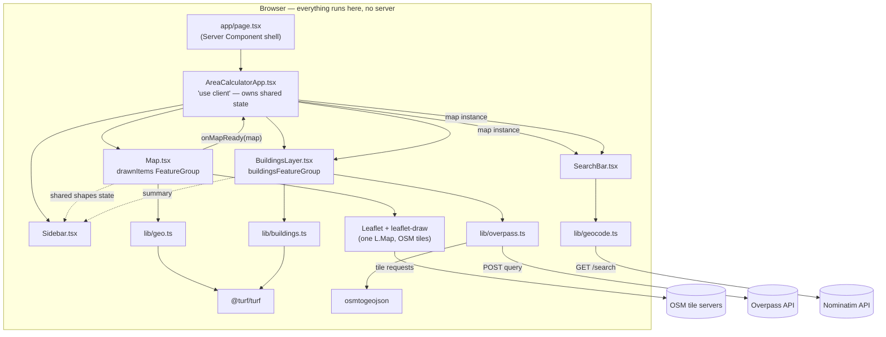

<div align="center">

# Web GIS Area Calculator

**Draw regions on a map, measure their real-world area, search for any place, and load live OpenStreetMap building footprints — all in the browser, no backend required.**

Built with Next.js 16 · React 19 · TypeScript · Leaflet · Turf.js

[Overview](#overview) · [Quick Start](#quick-start) · [How It Works](#how-it-works) · [GIS Concepts for Newcomers](#gis-concepts-for-newcomers) · [Function Reference](#function-reference) · [License](#license)

</div>

---

> **New to GIS?** This README assumes **no prior Geographic Information Systems experience**. Jargon is defined the first time it appears, and there is a dedicated [GIS Concepts for Newcomers](#gis-concepts-for-newcomers) section that explains map tiles, coordinate systems, and what actually happens on the wire when you interact with the map.

> **Conventions:** this project uses **npm** and **Tailwind CSS**. All commands assume you are inside the `webgis-app/` directory.

## Overview

The Web GIS Area Calculator is a single-page web app for measuring the real-world size of regions you draw on a map. On load it opens a **full-screen interactive map centered on Pakistan**, using free [OpenStreetMap](https://www.openstreetmap.org/) tiles. You can:

- **Search for any address or place** in the top search bar and fly the map straight to it.
- **Draw polygons and rectangles** anywhere on Earth.
- See each shape's **geodesic area** (its true area on the curved surface of the Earth) in **m²**, **km²**, **acres**, and **marla** (a traditional South Asian land unit, standardized here as 272.25 sq ft) — shown in a **popup on the map** and in the **sidebar** (a bottom bar on mobile).
- **Edit** a shape's vertices or **delete** shapes.
- **Save** shapes for the current browser session (in-memory — see [Limitations](#limitations--roadmap)).
- **Load real OpenStreetMap building footprints** for the current view — click **"Load Buildings Here"** to fetch actual house/commercial/industrial outlines, colored by type, with area and type shown on click.

The engineering focus is making [Leaflet](https://leafletjs.com/) (a browser-only mapping library) cooperate safely with Next.js server rendering, and being disciplined about **coordinate order** — GeoJSON uses `[longitude, latitude]` while Leaflet uses `LatLng(latitude, longitude)`.

## Features

| Feature | What it does | Key modules |
| --- | --- | --- |
| **Address search** | Geocode a place name/address and fly the map to it, with a marker. | `components/SearchBar.tsx`, `lib/geocode.ts` |
| **Draw & measure** | Draw polygons/rectangles; compute geodesic area in 4 units. | `components/Map.tsx`, `lib/geo.ts` |
| **Edit / delete** | Adjust vertices or remove shapes via the draw toolbar. | `components/Map.tsx` |
| **Shape list** | Sidebar list of every shape with its area and Save/Delete. | `components/Sidebar.tsx` |
| **OSM buildings** | Fetch, categorize, style, and render live building footprints. | `components/BuildingsLayer.tsx`, `lib/overpass.ts`, `lib/buildings.ts` |

## Tech Stack

| Layer | Choice | Notes |
| --- | --- | --- |
| Framework | **Next.js 16** (App Router) | Uses the `app/` directory; React 19. |
| Language | **TypeScript** | Strict typing; `@/*` path alias points at the project root. |
| Mapping | **raw Leaflet + leaflet-draw** | We call Leaflet directly, **not** `react-leaflet` (see note below). |
| Geo math | **@turf/turf** | `turf.area()` for geodesic area; `turf.simplify()` to thin dense geometry. |
| Building data | **Overpass API + `osmtogeojson`** | Live building queries; converts raw OSM JSON to GeoJSON. Runs in the browser. |
| Geocoding | **Nominatim** | Address/place search; no API key. |
| Persistence | **None (in-memory)** | No database. State lives in memory for the current session. |
| Styling | **Tailwind CSS v4** | Utility classes via PostCSS. |
| Tests | **Vitest + fast-check + Testing Library** | Unit, property-based, and DOM tests; Leaflet/`fetch` are mocked. |

> **Note on `react-leaflet`:** it appears in `package.json` from the scaffold but is **intentionally unused**. The app needs direct control over Leaflet's draw-control lifecycle, Strict-Mode guarding, and layer stamps, which is cleaner with raw Leaflet. Treat any `react-leaflet` import as a mistake.

## Quick Start

### Prerequisites

- **Node.js 18.18+** (Node 20 LTS recommended for Next.js 16)
- **npm** (bundled with Node)
- No account, API key, or database — everything runs client-side against free public OSM services.

### Install & run

```bash
npm install
npm run dev
```

Open [http://localhost:3000](http://localhost:3000). Try it:

1. **Search** for a city in the top bar (e.g. "Lahore") and pick a result.
2. **Draw** a polygon with the toolbar (top-left) and read its area in the popup/sidebar.
3. **Zoom in** to level 15+ and click **"Load Buildings Here"** to fetch real building footprints.

### Other commands

```bash
npm test          # run the full test suite once
npm run test:watch # watch mode
npm run build     # production build
npm run lint      # eslint
```

## How It Works

The app is **entirely client-side** — there is no backend or database. Because `app/page.tsx` is a server component and can't hold React state, a single client component (`AreaCalculatorApp`) owns all shared state and wires everything together. `Map.tsx` (drawing), `BuildingsLayer.tsx` (buildings), and `SearchBar.tsx` (search) all operate on the **same** Leaflet map instance but keep their concerns isolated.



### Design decisions

- **Server/client split is for SSR safety, not persistence.** `Map`, `BuildingsLayer`, and `SearchBar` are all loaded via `next/dynamic(..., { ssr: false })` because they touch Leaflet's browser-only APIs and must never run during server rendering.
- **One map, isolated concerns.** `Map.tsx` exposes its single map instance via `onMapReady(map)`. Siblings add their own layers/markers to that same map rather than creating a second one, so features never clobber each other.
- **Pure domain logic.** Area math (`lib/geo.ts`), building logic (`lib/buildings.ts`), Overpass/query logic (`lib/overpass.ts`), and geocoding (`lib/geocode.ts`) are all framework-free pure functions — trivially unit-testable, no React or Leaflet inside.

### Data flow: draw → area

1. You place vertices with the polygon tool. Closing the shape makes **leaflet-draw fire `L.Draw.Event.CREATED`** with the new layer.
2. `Map.tsx`'s CREATED handler adds the layer to its `drawnItems` feature group.
3. **`layer.toGeoJSON()`** produces a `Feature<Polygon>` with coordinates in **`[lng, lat]`** order (Leaflet handles the LatLng → GeoJSON conversion).
4. **`calculateArea(feature)`** (`lib/geo.ts`) calls **`turf.area()`** → **m²** (geodesic), then derives km², acres, and marla. Returns an `AreaResult`.
5. The handler binds and opens a popup, then calls **`onShapeCreated(shape)`** to add a `ShapeState` to shared state.
6. **`Sidebar`** re-renders and lists the shape with a **Save** button.

### Data flow: address search → fly to place

1. You type in the search bar. Input is **debounced (450 ms)** so a request only fires after you pause.
2. **`geocodeAddress(query)`** (`lib/geocode.ts`) sends a `GET` to Nominatim; any previous in-flight request is aborted so a slow old response can't overwrite a newer one.
3. Nominatim returns matches; each is normalized to a `GeocodeResult` (`lat`, `lon`, optional `boundingBox`).
4. You pick a result. The map **`fitBounds()`** to its bounding box (or `setView()` for a precise point) and drops a marker with a popup.

### Data flow: load OSM buildings

1. Click **"Load Buildings Here."** `BuildingsLayer` checks `map.getZoom()`; below `MIN_BUILDINGS_ZOOM` (15) it refuses (the bbox would be too large) and asks you to zoom in.
2. **Cache check.** If the current viewport is inside the last fetched bounds, the cached result is reused — no network call.
3. **Fetch.** On a cache miss it aborts any in-flight request and calls **`fetchBuildingsInBounds(bounds, { signal })`**, which builds an Overpass QL query and POSTs it. If a mirror is slow or returns a transient error (429/502/503/504), it **fails over to the next Overpass mirror** automatically.
4. **Convert.** The raw OSM JSON is turned into a GeoJSON `FeatureCollection` by **`osmtogeojson`**.
5. **Simplify (if dense).** `simplifyIfDense` runs `turf.simplify()` only when the geometry is unusually dense, preserving feature count.
6. **Render — once, batched.** A single `L.geoJSON(fc, { style, onEachFeature })` call adds the whole set to `buildingsFeatureGroup`, styled by category. Buildings render into a **dedicated pane below the drawing layer**, and that pane's pointer events are switched off while you're drawing so building clicks never hijack vertex placement.
7. **Click a building.** Only then is `turf.area()` computed (lazily) and a popup shown with the building's category and area.

## GIS Concepts for Newcomers

If you're new to mapping, read this section top to bottom — it explains what's actually happening behind the scenes.

### Map tiles: how a map image appears

A web map is not one giant image. It's a grid of **256×256 pixel PNG "tiles"**, one set per **zoom level**. When you pan or zoom, Leaflet works out which tiles cover your screen and requests just those, by URL, from OpenStreetMap's tile servers:

```
https://{s}.tile.openstreetmap.org/{z}/{x}/{y}.png
                                    │   │   │
                          zoom ─────┘   │   └───── tile row
                                    tile column
```

- `{z}` is the zoom level (0 = whole world in one tile; higher = more detail, more tiles).
- `{x}`/`{y}` index the tile within that zoom level's grid.
- `{s}` is a subdomain (a, b, c) that Leaflet rotates through to parallelize downloads.

So when you drag the map, your browser fires off a handful of small HTTP GETs like `.../15/21895/13383.png`. Leaflet stitches them into the seamless image you see and caches them so revisiting an area is instant. **Nothing about tiles involves this app's code** — it's Leaflet talking directly to OSM's servers. Tiles are just background imagery; they are *not* queryable data.

### Vector data vs. raster tiles

There are two very different kinds of "map data" here:

- **Raster tiles** (above) — pre-rendered images. Great for a backdrop, but you can't ask "what building is this?" — it's just colored pixels.
- **Vector data** — actual geographic shapes with coordinates and properties (a building polygon, your drawn region). This is what you *measure* and *query*. It's represented as **GeoJSON** in this app.

Your drawn shapes and the fetched buildings are vector data drawn *on top of* the raster tile backdrop.

### GeoJSON and the coordinate-order trap

**GeoJSON** (RFC 7946) is the standard JSON format for vector geographic data. A `Feature` has a `geometry` (the shape) and `properties` (metadata):

```json
{
  "type": "Feature",
  "properties": { "building": "house" },
  "geometry": { "type": "Polygon", "coordinates": [ [ [lng, lat], [lng, lat], ... ] ] }
}
```

The single biggest gotcha in web mapping: **GeoJSON stores positions as `[longitude, latitude]`** (x, y), but **Leaflet's `LatLng` is `(latitude, longitude)`** (y, x) — the reverse. Get this backwards and your shape lands in the wrong hemisphere. This app keeps `[lng, lat]` everywhere on the GeoJSON side and lets Leaflet's `toGeoJSON()` / `L.geoJSON()` convert at the boundary.

### Geodesic vs. planar area

The Earth is curved, but your screen is flat. **Planar** area math (treating the map as flat) is wildly wrong away from the equator, because a degree of longitude covers less ground near the poles. **Geodesic** area is measured on the Earth's actual ellipsoid and is correct anywhere. This app uses `turf.area()`, which is geodesic — so two shapes that look the same size on screen can report different real areas depending on latitude.

### Coordinate Reference Systems (CRS)

A **CRS** is the rulebook mapping coordinates to real locations. Two matter here:

- **WGS84 (EPSG:4326)** — the latitude/longitude system GeoJSON and GPS use.
- **Web Mercator (EPSG:3857)** — the flattened projection tiles are drawn in.

Leaflet bridges the two, so you think in lat/lng while it renders in Web Mercator.

### The Overpass API: querying real map data

Tiles are images; to get *queryable* building shapes you need OSM's raw data. **Overpass** is a free, read-only API for querying OpenStreetMap using a small language called **Overpass QL**. Instead of downloading the planet, you ask a targeted question — "every building in this rectangle" — and get back matching elements as JSON.

When you click "Load Buildings Here," the app builds and POSTs a query like:

```
[out:json][timeout:25];
(way["building"](south,west,north,east);relation["building"](south,west,north,east););
out geom;
```

- Both `way["building"]` (most buildings) and `relation["building"]` (multi-part buildings, e.g. with courtyards) are queried.
- The bbox order is **`south,west,north,east`** — Overpass QL's required order, *not* the `west,south,east,north` you'll see elsewhere.
- `out geom;` returns each element's coordinates inline, which `osmtogeojson` converts to GeoJSON polygons.

Because Overpass is a shared public resource, the app is deliberately conservative: an explicit button (never automatic), a zoom floor, a single-slot cache, request cancellation, and **automatic failover across mirrors** when one is overloaded.

### OSM tags

OpenStreetMap describes real-world features with simple `key=value` pairs called **tags** (e.g. `building=house`). One feature can carry many tags. This app reads the `building` tag to pick a category and color:

| OSM `building` value | Category |
| --- | --- |
| `house`, `residential`, `apartments`, `detached`, `terrace`, `semidetached_house` | **Residential** |
| `commercial`, `retail`, `office`, `shop`, `supermarket` | **Commercial** |
| `industrial`, `warehouse`, `manufacture` | **Industrial** |
| `yes` (generic) or anything unrecognized | **Other** |

### Geocoding (address search)

**Geocoding** turns text ("Lahore") into coordinates. This app uses **Nominatim**, OSM's search service. It's rate-limited (≈1 request/sec, no per-keystroke bulk traffic), which is why the search box debounces input and cancels superseded lookups. Each result may include a **bounding box**, letting the map frame a whole city rather than just centering on a point.

### End-to-end: what happens when you use the app

Putting it together, a single session touches three independent public services:

1. **Panning/zooming** → Leaflet requests **tile images** from OSM tile servers (background only).
2. **Searching a place** → `SearchBar` → Nominatim `GET /search` → fly to result.
3. **Loading buildings** → `BuildingsLayer` → Overpass `POST` → `osmtogeojson` → rendered vector polygons you can click and measure.

Your drawn shapes never leave the browser — there's no server of our own in the loop.

## Function Reference

Key exported modules, their inputs/outputs, and the GIS gotcha to watch for each.

| File | Export | Purpose | Inputs → Outputs | Gotcha |
| --- | --- | --- | --- | --- |
| `lib/geo.ts` | `calculateArea` | Geodesic area of a drawn shape in 4 units. | `Feature<Polygon>` → `AreaResult { m2, km2, acres, marla }`; throws on invalid input. | Area is **geodesic**, not planar — value depends on latitude. |
| `lib/geo.ts` | `isPolygonFeature` | Type guard validating arbitrary input. | `unknown` → `value is Feature<Polygon>`. | Requires a **closed** outer ring (≥ 4 positions, first = last) within valid lng/lat bounds. |
| `lib/geocode.ts` | `geocodeAddress` | Forward-geocode text to coordinates via Nominatim. | `(query, options?: { signal?, limit? })` → `Promise<GeocodeResult[]>`; rejects with typed `GeocodeError` or platform `AbortError`. | Blank query short-circuits to `[]`; respect Nominatim's ~1 req/sec policy (search box debounces). |
| `lib/overpass.ts` | `fetchBuildingsInBounds` | Fetch OSM buildings for a viewport, with mirror failover. | `(bounds, options?: { signal? })` → `Promise<FeatureCollection>`; rejects with typed `OverpassError` or `AbortError`. | Buildings may be `Polygon` **or** `MultiPolygon`. Transient errors fail over to the next mirror. |
| `lib/overpass.ts` | `buildOverpassQuery` | Build the Overpass QL query for a bbox. | `L.LatLngBounds` → `string`. | Bbox order is `south,west,north,east`; normalizes wrapped longitudes and splits at the antimeridian. |
| `lib/overpass.ts` | `OVERPASS_ENDPOINTS`, `MIN_BUILDINGS_ZOOM` | Mirror list (tried in order); zoom floor (15). | constants. | Below zoom 15 the bbox is too large; queries aren't attempted. |
| `lib/buildings.ts` | `categorizeBuildingTag` | Map an OSM `building` tag to a category. | `string \| undefined` → `'residential' \| 'commercial' \| 'industrial' \| 'other'`. | Total function; `'yes'` and unknown values fall back to `'other'`. |
| `lib/buildings.ts` | `buildingPopupHtml` | Format a building's click popup (type + area). | `BuildingFeature` → HTML `string`. | Calls `turf.area()` **lazily**, only on click; adds km² only when ≥ 1,000,000 m². |
| `lib/buildings.ts` | `simplifyIfDense` | Thin dense geometry before rendering. | `FeatureCollection` → `FeatureCollection` (same length/properties). | No-ops on sparse input; tolerance chosen not to distort outlines. |
| `lib/buildings.ts` | `styleForBuildingFeature`, `flatBuildingStyle`, `BUILDING_CATEGORY_COLORS` | Leaflet path styling by category. | `(feature)` → `L.PathOptions`. | Above `MAX_STYLED_FEATURES` (2000), a single flat style is used for speed. |
| `components/Map.tsx` | `Map` | Own the map, tiles, draw control, and shape↔state sync. | Props: `shapes`, `onShapeCreated`, `onShapeEdited`, `onShapeDeleted`, `onMapReady?`. | Default view is Pakistan; `onMapReady` fires once so siblings share the map. |
| `components/SearchBar.tsx` | `SearchBar` | Address search that flies the map to a result. | Props: `map: L.Map \| null`. | Debounced + cancellable; uses a CSS `divIcon` marker (avoids broken default marker images under bundlers). |
| `components/BuildingsLayer.tsx` | `BuildingsLayer` | Fetch, cache, style, render OSM buildings. | Props: `map`, `onBuildingsChange?`. | Owns a separate pane/FeatureGroup; isolates clicks during drawing. |
| `components/Sidebar.tsx` | `Sidebar` | List shapes with area; Save/Delete; optional buildings summary. | Props: `shapes`, `onSave`, `onDelete`, `buildingsSummary?`. | Omitting `buildingsSummary` renders exactly as before that feature existed. |
| `types/geo.ts` | `PolygonFeature`, `AreaResult`, `ShapeState`, `GeocodeResult`, `Building*` | Shared TypeScript types. | — | All GeoJSON coordinates are `[lng, lat]`; building/geocode types are additive. |

### The three Map.tsx gotchas

1. **SSR** — Leaflet touches `window` at import; `Map.tsx` is `'use client'` and loaded only via `next/dynamic({ ssr: false })`, with a defensive `typeof window === 'undefined'` guard.
2. **React Strict Mode** — effects run twice in dev; a `mapRef.current` guard plus `map.remove()` on cleanup guarantee **one live map instance**.
3. **Coordinate order** — `[lng, lat]` (GeoJSON) vs. `LatLng(lat, lng)` (Leaflet). Conversions happen only at the `toGeoJSON()` / `L.geoJSON()` boundary.

## Project Structure

```
webgis-app/
├── app/
│   ├── layout.tsx                  # Root layout
│   ├── page.tsx                    # Server component; renders AreaCalculatorApp
│   └── globals.css                 # Tailwind + global styles
├── components/
│   ├── AreaCalculatorApp.tsx       # 'use client' wrapper; owns shared state
│   ├── Map.tsx                     # Leaflet + leaflet-draw (drawing, default Pakistan view)
│   ├── SearchBar.tsx               # Address/place search (Nominatim)
│   ├── BuildingsLayer.tsx          # Fetches/renders OSM building footprints
│   └── Sidebar.tsx                 # Shape list + buildings summary; Save/Delete
├── lib/
│   ├── geo.ts                      # calculateArea, isPolygonFeature
│   ├── geocode.ts                  # geocodeAddress (Nominatim)
│   ├── overpass.ts                 # Overpass query + fetchBuildingsInBounds (mirror failover)
│   └── buildings.ts                # Categorization, styling, simplification, popups
├── types/
│   └── geo.ts                      # Shared types (shapes, buildings, geocode)
├── vitest.config.ts                # Test runner config (@/* alias, jsdom)
└── LICENSE                         # MIT + third-party data notices
```

> There is no `app/api/`, `models/`, or `.env` — this app has **no backend or database**. All state is in-memory for the current session.

## Testing

```bash
npm test
```

Coverage:

- **Geo math** — `lib/geo.test.ts` (known polygons; equator vs. pole for geodesic behavior) and `lib/geo.property.test.ts` (fast-check: area non-negativity, unit-conversion consistency, purity, validation soundness).
- **Geocoding** — `lib/geocode.test.ts` mocks `fetch` to assert result normalization, URL encoding, empty/blank short-circuits, and network/HTTP/parse/abort error paths.
- **Overpass** — `lib/overpass.test.ts` / `.property.test.ts` assert bbox well-formedness, non-mutation of input bounds, **mirror failover**, and error paths — no real network.
- **Buildings** — `lib/buildings.test.ts` / `.property.test.ts` assert categorization is total/deterministic, `simplifyIfDense` preserves feature count/properties, and popup formatting.
- **Components (jsdom)** — `Sidebar`, `AreaCalculatorApp`, and `BuildingsLayer` (mocked Leaflet + Overpass) cover rendering, zoom guard, bbox cache, stale-request abortion, empty/error states, batched rendering, lazy area, and drawing isolation. `Map.test.tsx` asserts one live map instance under Strict Mode and `preferCanvas: true`.

## Limitations & Roadmap

- **No backend/persistence.** State is in-memory only; refreshing clears everything. `handleSave`/`handleDelete` in `AreaCalculatorApp.tsx` are the intended seam for a future IndexedDB layer.
- **Drawn shapes are Polygon-only.** `isPolygonFeature`/`calculateArea` accept single polygons. (Fetched buildings *do* support `MultiPolygon`.)
- **OSM building coverage varies by region.** A "no data" result in under-mapped areas is expected, not a bug.
- **No clustering for huge result sets.** Above 2000 buildings a flat style is used; true clustering is a follow-up.
- **Public service limits.** OSM tiles ([tile policy](https://operations.osmfoundation.org/policies/tiles/)), Overpass, and Nominatim are shared community resources with fair-use limits — fine for development, but use a proper provider (or self-host) for production.

## Acknowledgements

- Map data & tiles © [OpenStreetMap](https://www.openstreetmap.org/copyright) contributors (ODbL).
- [Overpass API](https://wiki.openstreetmap.org/wiki/Overpass_API), [Nominatim](https://nominatim.org/), [Leaflet](https://leafletjs.com/), [leaflet-draw](https://github.com/Leaflet/Leaflet.draw), [Turf.js](https://turfjs.org/), and [osmtogeojson](https://github.com/tyrasd/osmtogeojson).

## License

Released under the **MIT License** — see [`LICENSE`](./LICENSE) for the full text and third-party data/service notices (OpenStreetMap, Overpass, Nominatim).
# geomeasure
